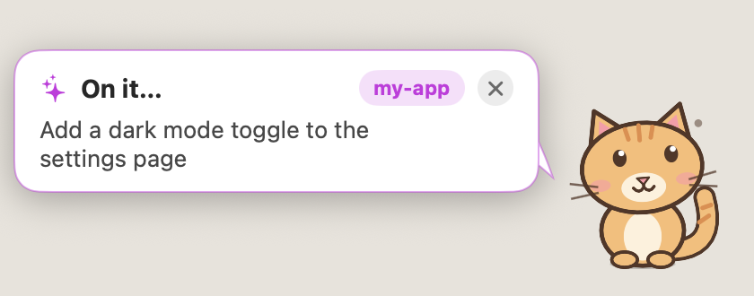
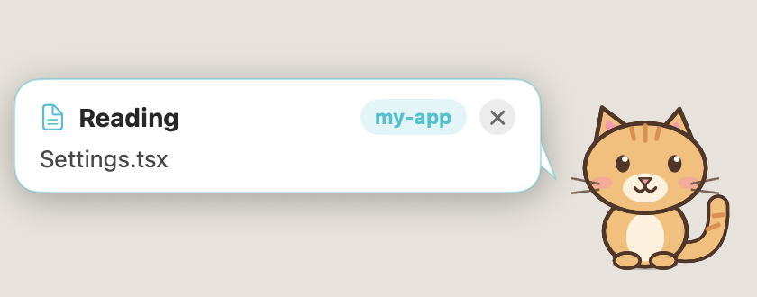
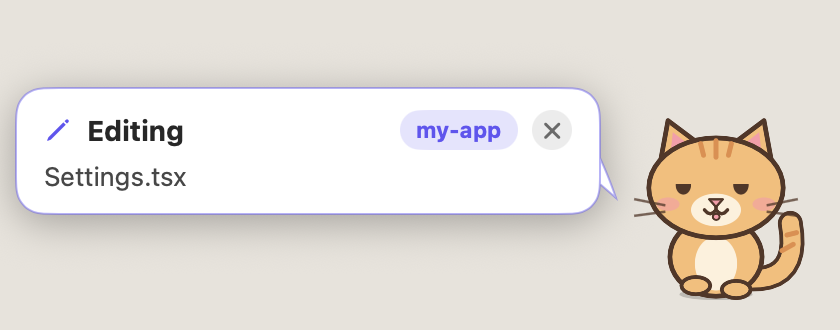
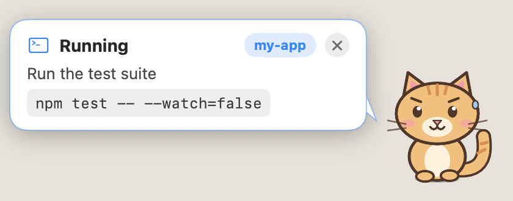
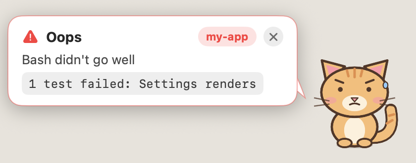
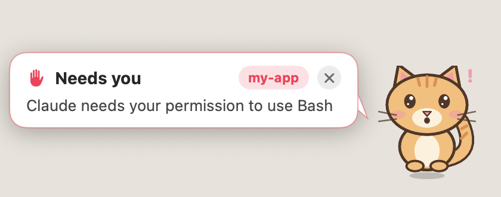
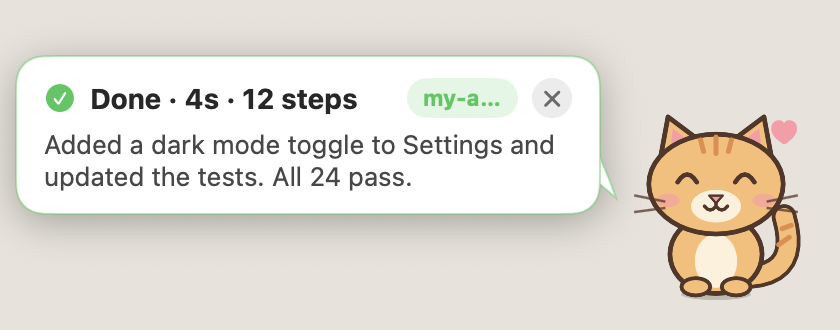
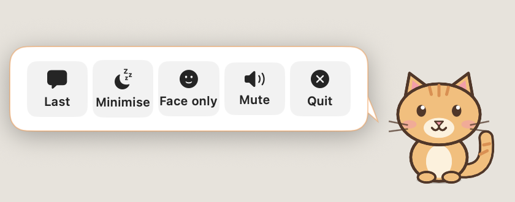

# VibeCat

A tiny desktop cat that shows what [Claude Code](https://claude.com/claude-code) is doing, so you can look away from the terminal and still know when it needs you.

Free and open source under the MIT license. One Swift file, no dependencies, and nothing leaves your machine.

<p align="center"></p>

<p align="center"><sub>A scripted session: prompt, reading, editing, a failing test, a permission request, done.</sub></p>

## Screenshots

<table>
<tr><td align="center"><br><sub>Thinking about your prompt</sub></td><td align="center"><br><sub>Reading: curious, eyes scanning</sub></td></tr>
<tr><td align="center"><br><sub>Editing: focused, tongue out</sub></td><td align="center"><br><sub>Grinding through a long task: sweating</sub></td></tr>
<tr><td align="center"><br><sub>A tool failed: ears back, error shown</sub></td><td align="center"><br><sub>Needs your permission: bouncing, pleading</sub></td></tr>
<tr><td align="center"><br><sub>Done, with Claude's own summary</sub></td><td align="center"><br><sub>Click the cat for its menu</sub></td></tr>
</table>

## What it does

- **Reacts to the task.** Curious while reading files, focused while editing, busy while running commands, and thoughtful while thinking. The longer a task grinds on, the more it sweats.
- **Says what's happening.** A speech bubble shows the current step. When Claude finishes, it shows what Claude concluded.
- **Gets your attention.** A permission request makes the cat bounce and chirp, shows what Claude wants to run, and keeps nagging until you answer. Click the bubble to jump to your terminal.
- **Reports failures.** A failed tool call gives it an "oops" face with the error. If Claude itself stops on an API error, such as a rate limit or a billing problem, the cat says so and keeps saying so until you go back.
- **Handles several sessions.** One session's chatter never hides another session's request.
- **Stays out of the way.** Bubbles auto-hide, close with the x, and hide when you hover over them. Permission requests are the one exception to hover-hide, so you can still click them.
- **Faces only, if you prefer.** Click the cat and choose **Face only** to drop the speech bubbles and keep just the reactions and sounds. **Last** shows the latest message on demand.
- **Minimises.** Choose **Minimise** and the cat shrinks to a small icon. Click it to wake it. It never steals focus, and you can drag it anywhere.

## Requirements

- macOS 14 or newer
- A current Claude Code (the hooks it uses arrived in 2.1)
- Xcode command line tools: `xcode-select --install`
- `jq`: `brew install jq`

## Install

```sh
git clone https://github.com/heptafox/claude-vibe-cat.git
cd claude-vibe-cat
./install.sh     # builds, self-tests, and adds the hooks to ~/.claude/settings.json
./vibecat        # start the cat
```

Then restart any open Claude Code sessions, because hooks load at session start. To launch at login, add the built `vibecat` to System Settings, General, Login Items.

`install.sh` backs up your settings to `~/.claude/settings.json.bak` and adds its hook next to any you already have, on eight events: PreToolUse, PostToolUseFailure, PermissionRequest, Notification, UserPromptSubmit, Stop, StopFailure and SessionEnd. Re-run it after pulling a new version, since that list can change. The hooks point at this folder's `hook.sh`, so keep the folder where it is, or re-run the installer after moving it.

## Using it

Click the cat to open its menu.

| Button | What it does |
| --- | --- |
| Last | Shows the most recent message again |
| Minimise | Shrinks the cat to an icon and silences it. Click the icon to wake it |
| Face only / Show text | Toggles speech bubbles. The cat's expressions and sounds stay on |
| Mute / Unmute | Toggles the Pop and Glass sounds |
| Quit | Closes VibeCat |

Drag the cat to move it. It remembers its position. Right-clicking it offers the same actions.

## Privacy

`hook.sh` writes a trimmed copy of each Claude Code event to `~/.vibecat/events.jsonl`. It drops file contents and edit text and cuts long strings to 300 characters. It keeps prompts, shell commands and file names so the bubble can show them. The log is plain text, readable only by your user account. VibeCat makes no network requests. Settings live in the `vibecat` preferences domain.

## How it works

`hook.sh` is a Claude Code hook that appends one JSON line per event to the log. `vibecat.swift` polls that file, turns each event into a mood and a bubble, and draws the cat on a SwiftUI canvas. [CLAUDE.md](CLAUDE.md) has a deeper architecture tour.

## Troubleshooting

- **The cat never reacts.** Restart your Claude Code session, since hooks only load at startup. Check that `~/.vibecat/events.jsonl` grows while Claude works, and that `jq` is installed.
- **No Oops face, or no "Claude stopped".** The cat needs the PostToolUseFailure and StopFailure hooks. Re-run `./install.sh`, then restart the session.
- **The cat is off-screen.** Quit it, run `defaults delete vibecat origin`, and start it again.
- **Clicking a bubble doesn't focus my terminal.** The hook records which app launched the shell, so any terminal started from the Finder, Dock or Spotlight works, at app level and not per tab. A session over SSH, or in a tmux server started elsewhere, has no terminal app to report.

## Uninstall

From the project folder, remove the hooks and the cat's data:

```sh
jq --arg h "$PWD/hook.sh" '.hooks |= (map_values(map(select(all(.hooks[]; .command != $h)))) | with_entries(select(.value | length > 0)))' \
  ~/.claude/settings.json > /tmp/settings.new && mv /tmp/settings.new ~/.claude/settings.json
pkill -x vibecat
rm -rf ~/.vibecat
defaults delete vibecat
```

This leaves any other hooks you have untouched.

## Contributing

Contributions are welcome, from a one-line fix to a new expression.

1. Fork the repo and create a branch.
2. Build with `swiftc -O vibecat.swift -o vibecat` and run `./vibecat --test`. It prints `ok` when everything passes.
3. Add a case to `selfTest()` for any logic you change.
4. Open a pull request that says what changed and why. A screenshot helps for anything visual.

To try a mood without running Claude, append an event to the log:

```sh
echo '{"event":"Notification","session":"x","cwd":"/demo","message":"Allow Bash?","kind":"permission_prompt"}' >> ~/.vibecat/events.jsonl
```

Set `VIBECAT_EVENTS=/path/to/file.jsonl` to run a test instance against a scratch log instead of the real one.

The project is deliberately one file with no dependencies. Please keep it that way unless a change clearly needs more.

Ideas that would be welcome:

- Focus the exact terminal tab, not just the app
- Judge effort from the task itself instead of step count and time
- More cat colours and accessories
- Intel Mac and older macOS testing
- A packaged `.app` and a Homebrew formula
- Screenshots and a short demo GIF for this README

## License

[MIT](LICENSE)
